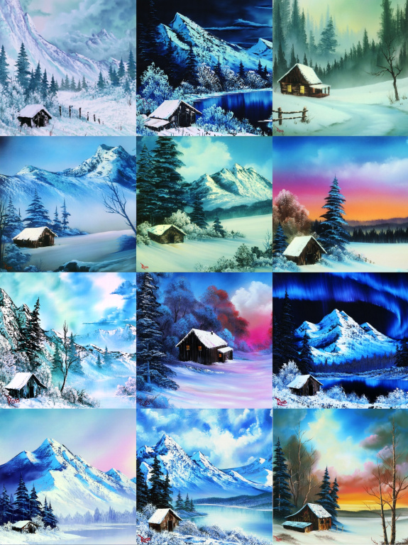

```{r setup, include = FALSE}
knitr::opts_chunk$set(
  echo = FALSE, 
  message = FALSE,
  warning = FALSE, 
  fig.align = "center", 
  fig.path = "figures/"
)
library(tidyverse)
library(lubridate)
library(timevis)
library(patchwork)

df <- read_csv("data/olddata.csv", col_types = cols(
                    .default = col_double(),
                    EPISODE = col_character(),
                    TITLE = col_character(),
                    DATE = col_date(format = "%Y-%m-%d"),
                    PAINTER = col_character())) %>% 
  mutate(SEASON = str_extract(EPISODE, "S([0-9][0-9])"),
         # clusmy way of getting rid of the 0...
         SEASON = as.character(as.numeric(str_extract(SEASON, "\\d\\d"))))

df_bob <- df %>% filter(PAINTER == "Bob Ross")
keywords <- select(df, APPLE_FRAME:WOOD_FRAMED)
n_bobross <- nrow(df_bob)
```

This is based on an article by Walt Hickey which is titled "A Statistical Analysis of the Work of Bob Ross."

Bob Ross was a consummate teacher. He guided fans along as he painted “happy trees,” “almighty mountains” and “fluffy clouds” over the course of his 11-year television career on his PBS show, “The Joy of Painting.” In total, Ross painted `r n_bobross` works on the show, relying on a distinct set of elements, scenes and themes, and thereby providing thousands of data points. I decided to use that data to teach something myself: the important statistical concepts of conditional probability and clustering, as well as a lesson on the limitations of data.

You can visualise the span of each season for season 1 to 7 in Figure \@ref(fig:timevis).

```{r timevis, fig.cap = "Timeline of \"The Joy of Painting\" from Season 1-7."}
data <- df %>% 
  group_by(SEASON) %>% 
  summarise(start = min(DATE), end = max(DATE)) %>% 
  mutate(content = SEASON) %>% 
  filter(SEASON %in% 1:7)

timevis(data, showZoom = FALSE, height = "150px")
```

So let’s perm out our hair and get ready to create some happy spreadsheets!

What I found — through data analysis and an interview with one of Ross’s closest collaborators — was a body of work that was defined by consistency and a fundamentally personal ideal. Ross was born in Daytona, Fla., and joined the Air Force at 17. He was stationed in Fairbanks and spent the next 20 years in Alaska. His time there seems to have had a significant impact on his preferred subjects of trees, mountains, clouds, lakes and snow.

(ref:cabin) Paintings by Bob Ross featured on PBS’s “The Joy of Painting.” *The Bob Ross name and images are trademarks of Bob Ross Inc. All rights reserved.*

```{r cabin, fig.cap="(ref:cabin)", out.width = "90%"}

```

Of the `r nrow(df)` episodes of “The Joy of Painting” — whose first run was from `r year(min(df$DATE))` to `r year(max(df$DATE))` and which continues to air in reruns on PBS stations nationwide — Ross painted in `r n_bobross`, and the rest featured a guest, most frequently his son Steve Ross. Based on images of Bob Ross’s paintings available in the Bob Ross Inc. store, I coded all the episodes using 67 keywords describing content (trees, water, mountains, weather elements and man-made structures), stylistic choices in framing the paintings, and guest artists, for a grand total of `r scales::comma(sum(keywords))` tags.

I analyzed the data to find out exactly what Ross, who died in 1995, painted for more than a decade on TV. The top-line results are to be expected — wouldn’t you know, he did paint a bunch of mountains, trees and lakes! — but then I put some numbers to Ross’s classic figures of speech. He didn’t paint oaks or spruces, he painted “happy trees.” He favored “almighty mountains” to peaks. Once he’d painted one tree, he didn’t paint another — he painted a “friend.”

How often each tag that appeared more than five times showed up over the `r n_bobross` episodes is shown in Figure \@ref(fig:barplot).


```{r barplot, fig.height = 8, fig.cap="Percentage containing each element"}
df_longer <- df %>% 
  filter(PAINTER == "Bob Ross") %>% 
  select(APPLE_FRAME:WOOD_FRAMED) %>% 
  pivot_longer(cols = everything(), 
               names_to = "keyword",
               values_to = "tag") %>% 
  filter(tag!=0) %>% 
  group_by(keyword) %>% 
  tally() %>% 
  filter(n > 5) %>% 
  mutate(perc = round(100 * n / n_bobross),
         keyword2 = str_to_title(keyword),
         keyword2 = fct_recode(keyword2, 
                               `At least one tree` = "Tree",
                               `At least two trees` = "Trees",
                               `Deciduous tree` = "Deciduous",
                               `Coniferous tree` = "Conifer",
                               `At least one mountain` = "Mountain",
                               `River or stream` = "River",
                               `Snow-covered mountain` = "Snowy_mountain",
                               `At least two mountains` = "Mountains",
                               `Man-made structure` = "Structure",
                               `Cumulus clouds` = "Cumulus",
                               `Winter setting` = "Winter",
                               `Oval frame` = "Oval_frame",
                               `Cirrus clouds` = "Cirrus",
                               `Palm trees` = "Palm_trees"
                               ),
         keyword2 = fct_reorder(keyword2, n))

g1 <- ggplot(df_longer, aes(perc, keyword2)) + 
  geom_col(fill = "#008FD5") + 
  geom_text(aes(label = perc), hjust = -0.3, size = 3) +
  theme_void() + 
  theme(axis.text.y = element_text(size = 12, color = "black", hjust = 1),
        plot.background = element_rect(fill = "#F0F0F0", color = "transparent"),
        plot.margin = margin(10, 10, 10, 10),
        plot.title = element_text(size = 16, face = "bold", color = "black"),
        plot.subtitle = element_text(size = 14, margin = margin(b = 10, t = 5)),
        plot.title.position = "plot",
        plot.caption = element_text(size = 8, color = "black")) + 
  labs(title = "The Paintings of Bob Ross")

g2 <- ggplot() + theme_void() +  
  theme(plot.background = element_rect(fill = "#5C5E5F", color = "transparent"),
        plot.caption = element_text(size = 8, color = "white",
                                    margin = margin(t = 5, b = 5))) + 
  labs(caption = "SOURCE: THE JOY OF PAINTING")

g1 / g2 + 
  plot_layout(heights = c(90, 1))
```

```{r fns}
count_key <- function(key) { sum(df_bob[[key]]) }

perc_keys <- function(..., round = TRUE, digits = 0) {
  keys <- list(...)
  nkey <- length(keys)
  n <- nrow(df_bob)
  out <- rep(0, n)
  for(akey in keys) out <- out + df_bob[[akey]]
  if(round) return(round(sum(out == nkey) / n * 100, digits))
  sum(out == nkey) / n
}

ratio_keys <- function(cond, given) {
  num <- do.call("perc_keys", list(cond, given, round = FALSE))
  den <- do.call("perc_keys", list(given, round = FALSE))
  round(num / den * 100)
}

plural <- function(count) { ifelse(count==1, "", "s") }
```